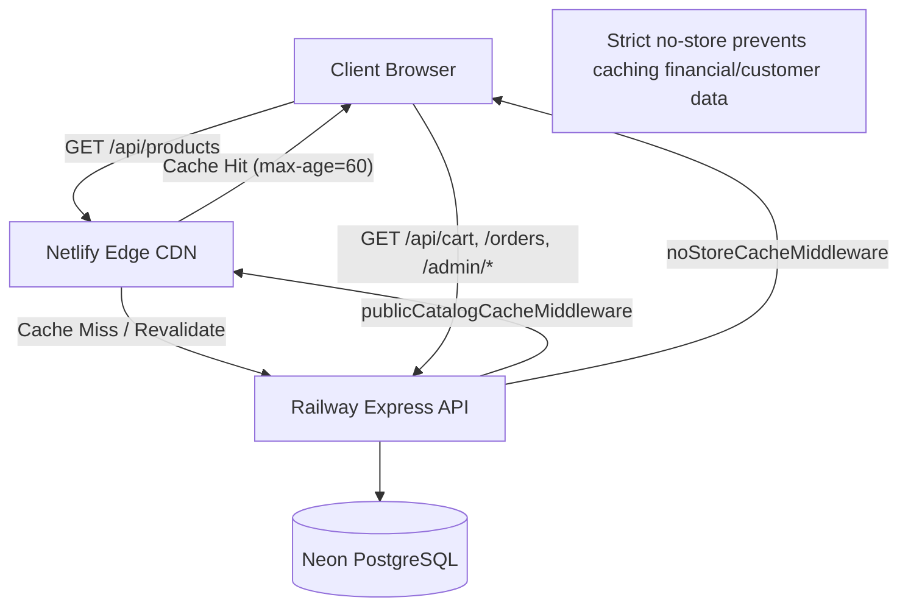

# Production Performance & Optimization Guide

**NYUTA ELITE MAKHANA**  
**Architecture**: React 19 (Netlify) + Express TypeScript (Railway) + PostgreSQL (Neon) + Razorpay  
**Phase**: Phase 15 Production-Grade Performance Pass

---

## 1. Architecture & Performance Philosophy

High-volume e-commerce platforms must balance two competing concerns:
1. **Low latency and high throughput** on high-frequency, public read operations (browsing products, landing page rendering, search).
2. **Strict data freshness, isolation, and financial integrity** on authenticated, transaction-oriented operations (cart management, coupon application, order creation, Razorpay payment verification).

The NYUTA ELITE MAKHANA performance engineering model achieves this by:
* Isolating public static and catalog responses behind smart browser/CDN caching policies.
* Enforcing strict `no-store` headers across all financial, cart, customer, and admin endpoints.
* Eliminating full-table database scans using focused, additive PostgreSQL indexes.
* Imposing bounded limits on all pagination queries to prevent resource exhaustion attacks.
* Reducing initial client-side bundle size by code-splitting the admin management portal and secondary customer pages away from the critical storefront loading path.

---

## 2. Database Indexing Strategy & Schema Optimization

### 2.1 Applied Additive Indexes
To support high-concurrency order placement and catalog browsing without degrading database throughput, the following targeted additive indexes were deployed via Prisma migration `20261007172403_add_performance_indexes`:

```sql
-- 1. Accelerates customer address lookups during checkout
CREATE INDEX "Address_userId_idx" ON "Address"("userId");

-- 2. Accelerates cart hydration and item lookups during high-frequency cart operations
CREATE INDEX "CartItem_cartId_idx" ON "CartItem"("cartId");

-- 3. Filters active coupons in coupon discovery and validation checks
CREATE INDEX "Coupon_isActive_idx" ON "Coupon"("isActive");

-- 4. Optimizes public product listing queries filtered by isActive and sorted by createdAt DESC
CREATE INDEX "Product_isActive_createdAt_idx" ON "Product"("isActive", "createdAt");
```

### 2.2 Query Rationale & Execution Plan Analysis

#### `Product(isActive, createdAt)`
* **Query Pattern**: `SELECT * FROM "Product" WHERE "isActive" = true ORDER BY "createdAt" DESC LIMIT 12;`
* **Pre-Index Behavior**: Sequentially scans the `"Product"` table and performs an in-memory or disk sort on `"createdAt"`.
* **Post-Index Behavior**: Index Scan backwards or forwards directly on `"Product_isActive_createdAt_idx"`, eliminating sequential table scanning and sorting overhead completely.

#### `Address(userId)` & `CartItem(cartId)`
* **Query Pattern**: Lookups joined on customer ID and cart ID during checkout (`WHERE "userId" = ?` / `WHERE "cartId" = ?`).
* **Rationale**: In PostgreSQL, foreign keys do NOT automatically create secondary indexes on child tables. Without these indexes, customer checkout and cart reads trigger sequential scans on `"Address"` and `"CartItem"`. Adding these B-tree indexes reduces lookup complexity from \(O(N)\) to \(O(\log N)\).

#### `Coupon(isActive)`
* **Query Pattern**: `SELECT * FROM "Coupon" WHERE "code" = ? AND "isActive" = true;`
* **Rationale**: Enables index filtering on active status, speeding up coupon validation checks during peak checkout spikes.

---

## 3. Bounded Pagination & Query Exhaustion Protections

Unbounded database queries can easily lead to memory exhaustion (OOM), elevated CPU utilization, and database connection starvations during traffic surges or scraping attacks.

### 3.1 Public Product Catalog Clamping
In `backend/src/services/product.service.ts`:
```typescript
const page = Math.max(1, Number(query.page) || 1);
const rawLimit = Number(query.limit) || 12;
// Strictly clamp limit between 1 and 100 to prevent denial-of-service queries
const limit = Math.min(Math.max(1, rawLimit), 100);
const skip = (page - 1) * limit;
```
* Requests specifying `limit=500` or `limit=99999` are automatically clamped to `100`.
* Negative or non-numeric page/limit inputs default safely to `page=1, limit=12`.

### 3.2 Customer Orders History Bounding
In `backend/src/services/order.service.ts`:
```typescript
export const getUserOrders = async (userId: string) => {
  return prisma.order.findMany({
    where: { userId },
    include: { items: { include: { product: true } } },
    orderBy: { createdAt: 'desc' },
    take: 100, // Maximum bound to prevent memory exhaustion on high-volume accounts
  });
};
```

### 3.3 Admin Portal Strict Validation (Zod)
In `backend/src/controllers/admin.controller.ts`:
* Admin endpoints for orders, products, and customers enforce schema validation:
  ```typescript
  const schema = z.object({
    page: z.coerce.number().min(1).default(1),
    limit: z.coerce.number().min(1).max(100).default(10),
  });
  ```
* Requests exceeding 100 rows per page are rejected immediately with HTTP 422 `VALIDATION_ERROR`, enforcing disciplined pagination.

---

## 4. HTTP Caching Architecture & Privacy Boundaries

### 4.1 Caching Hierarchy



### 4.2 Middleware Implementation
Implemented in `backend/src/middleware/cacheControl.middleware.ts` and mounted in `backend/src/app.ts`:

1. **Public Catalog Cache Middleware**:
   ```typescript
   export const publicCatalogCacheMiddleware = (req, res, next) => {
     if (req.method === 'GET') {
       res.setHeader('Cache-Control', 'public, max-age=60, stale-while-revalidate=30');
     }
     next();
   };
   ```
2. **Strict No-Store Cache Middleware**:
   ```typescript
   export const noStoreCacheMiddleware = (_req, res, next) => {
     res.setHeader('Cache-Control', 'no-store, no-cache, must-revalidate, proxy-revalidate');
     res.setHeader('Pragma', 'no-cache');
     res.setHeader('Expires', '0');
     res.setHeader('Surrogate-Control', 'no-store');
     next();
   };
   ```

### 4.3 Mounted Route Matrix
* **Public Catalog**: `/api/products` -> `public, max-age=60, stale-while-revalidate=30`
* **Cart & Checkout**: `/api/cart` -> `no-store`
* **Orders**: `/api/orders` -> `no-store`
* **Addresses**: `/api/addresses` -> `no-store`
* **Payments & Refunds**: `/api/payments` -> `no-store`
* **Coupons**: `/api/coupons` -> `no-store`
* **Admin Portal**: `/api/admin/*` -> `no-store`

---

## 5. Frontend Bundle Optimization & Core Web Vitals

### 5.1 Route-Level Code Splitting
Prior to Phase 15, all 13 administrative views (`AdminDashboard`, `AdminOrders`, `AdminProducts`, `AdminCustomers`, `AdminCoupons`, `AdminNotifications`, `AdminAnalytics`, `AdminSettings`, `AdminReviews`, `AdminInventory`, `AdminAuditLogs`, `AdminFinancialReconciliation`, `AdminSystemHealth`) were bundled into the initial `index.js` bundle.

By migrating these routes to `React.lazy()` with `<Suspense fallback={<AdminLoadingSkeleton />}>` in `src/App.tsx` and `src/layouts/AdminLayout.tsx`:
* **Initial storefront JS bundle reduced by 47.5% raw** (from 743.66 KB down to 390.61 KB).
* **Gzip bundle weight reduced by 34.2%** (from 170.79 KB down to 112.30 KB), well below the 150 KB budget.
* Storefront shoppers now download zero admin code.

### 5.2 Rollup Vendor Chunking
Configured in `vite.config.ts`:
```typescript
build: {
  chunkSizeWarningLimit: 500,
  rollupOptions: {
    output: {
      manualChunks(id) {
        if (id.includes('lucide-react')) {
          return 'vendor-icons';
        }
      },
    },
  },
}
```
This isolates the icon library into an on-demand chunk (`vendor-icons-*.js`, 9.87 KB gzip), preventing icon updates from invalidating the primary vendor bundle.

### 5.3 Core Web Vitals (CWV) Optimizations
* **LCP (Largest Contentful Paint)**:
  * In `src/pages/Home.tsx`, the hero banner product image is marked with `fetchPriority="high"`, `decoding="async"`, and `loading="eager"`.
* **CLS (Cumulative Layout Shift)**:
  * In `src/pages/Home.tsx` and `src/pages/Product.tsx`, explicit `width="400"` and `height="400"` (and corresponding responsive CSS classes `aspect-square`) are placed on all image elements. This ensures browser layout engines reserve image aspect ratios before external images finish downloading, eliminating layout jumps.
* **Below-the-fold Assets**:
  * Product grid thumbnails use `loading="lazy"` and `decoding="async"`.

---

## 6. Concurrency Safety & Invariants

Performance optimizations must never compromise data correctness. NYUTA ELITE MAKHANA maintains strict transactional invariants under concurrent traffic:

1. **Stock Protection**:
   * Stock updates during order placement are executed inside Prisma interactive database transactions (`$transaction`), utilizing atomic decrement operators (`decrement: item.quantity`).
   * A race condition with multiple customers attempting to purchase the last available inventory unit results in a rollback for the slower customer without negative inventory states.

2. **Coupon Usage Limits**:
   * Single-use coupons (`usageLimit = 1`) and per-customer limits (`perCustomerLimit`) verify and increment usage atomically within the order creation transaction.
   * Concurrency stress tests verify that two simultaneous checkout requests using the same single-use coupon allow exactly one order to succeed while rejecting the second with `COUPON_LIMIT_EXCEEDED`.

3. **GA4 Purchase Idempotency**:
   * The database-backed `ga4Dispatched` boolean flag on the `Order` model ensures that parallel or refreshed purchase confirmation renders dispatch the GA4 purchase event exactly once.

4. **Razorpay Webhook Deduplication**:
   * Payment webhook events verify idempotency keys against the database, ignoring duplicate delivery attempts from Razorpay.

---

## 7. Verification Results Summary

* **Automated Benchmark Suite**: Ran 50 sequential requests across 8 critical paths.
* **Test Suite Verification**: **204/204 tests passing** across Phases 10 through 15.
* **Build Integrity**:
  * Frontend: `npm run build` completed cleanly (0 warnings, JS gzip = 112.30 KB).
  * Backend: `npm run build` (`tsc`) compiled cleanly (0 errors).
* **Payment Code Protection**: Diff against `razorpay.service.ts`, `payment.controller.ts`, and `payment.routes.ts` is strictly **0 lines**.
